# System Architecture Analysis
<!-- generated in 0.00s -->

## Overview

- **Project**: /home/tom/github/semcod/swop
- **Primary Language**: python
- **Languages**: python: 67, md: 4, shell: 2, yaml: 1, json: 1
- **Analysis Mode**: static
- **Total Functions**: 425
- **Total Classes**: 104
- **Modules**: 76
- **Entry Points**: 226

## Architecture by Module

### swop.manifests.generator
- **Functions**: 34
- **Classes**: 2
- **File**: `generator.py`

### swop.markpact.doql_bridge
- **Functions**: 28
- **Classes**: 2
- **File**: `doql_bridge.py`

### swop.scan.scanner
- **Functions**: 27
- **File**: `scanner.py`

### swop.commands
- **Functions**: 26
- **File**: `commands.py`

### swop.markpact.graph_builder
- **Functions**: 19
- **File**: `graph_builder.py`

### swop.services.generator
- **Functions**: 17
- **Classes**: 2
- **File**: `generator.py`

### swop.resolve.resolver
- **Functions**: 15
- **Classes**: 3
- **File**: `resolver.py`

### swop.proto.generator
- **Functions**: 14
- **Classes**: 3
- **File**: `generator.py`

### swop.registry.pydantic_cross_check
- **Functions**: 12
- **Classes**: 1
- **File**: `pydantic_cross_check.py`

### swop.contracts.adapter
- **Functions**: 12
- **Classes**: 1
- **File**: `adapter.py`

### swop.cqrs.registry
- **Functions**: 12
- **Classes**: 2
- **File**: `registry.py`

### swop.markpact.parser
- **Functions**: 11
- **Classes**: 2
- **File**: `parser.py`

### swop.scan.report
- **Functions**: 11
- **Classes**: 4
- **File**: `report.py`

### swop.scan.cache
- **Functions**: 10
- **Classes**: 2
- **File**: `cache.py`

### swop.refactor.pipeline
- **Functions**: 10
- **Classes**: 2
- **File**: `pipeline.py`

### swop.tools.doctor
- **Functions**: 10
- **Classes**: 2
- **File**: `doctor.py`

### swop.tools.doctor_deep
- **Functions**: 10
- **Classes**: 3
- **File**: `doctor_deep.py`

### swop.config
- **Functions**: 9
- **Classes**: 5
- **File**: `config.py`

### swop.core
- **Functions**: 8
- **Classes**: 1
- **File**: `core.py`

### swop.tools.hook
- **Functions**: 8
- **Classes**: 1
- **File**: `hook.py`

## Key Entry Points

Main execution flows into the system:

### swop.markpact.doql_bridge.DoqlBridge._build_minimal_spec
- **Calls**: _MinimalDoqlSpec, self._load_entities, self._load_databases, self._load_interfaces, self._load_workflows, self._load_roles, self._load_integrations, self._load_webhooks

### swop.markpact.parser.ManifestParser.parse
- **Calls**: CODEBLOCK_RE.finditer, INCLUDE_RE.finditer, set, ManifestBlock, blocks.append, None.resolve, _seen.add, m.group

### swop.refactor.pipeline.RefactorPipeline.run
- **Calls**: FrontendScanner, frontend_scanner.scan, BackendSignals, self._build_graph, self.out_dir.mkdir, ModuleBuilder, RefactorResult, None.scan

### swop.commands._cmd_gen_registry
- **Calls**: swop.contracts.reader.load_contracts, getattr, getattr, swop.registry.generator.write_registry, print, None.resolve, Path.cwd, getattr

### swop.refactor.scanner.frontend.FrontendScanner.scan_file
- **Calls**: path.read_text, PageSignals, sorted, sorted, sorted, sorted, sorted, sorted

### swop.commands._cmd_scan
- **Calls**: swop.scan.scanner.scan_project, None.resolve, Path.cwd, Path, swop.config.load_config, swop.scan.render.write_report, written.items, print

### swop.commands._cmd_watch
- **Calls**: WatchEngine, print, engine.poll_once, swop.watch.engine.rebuild_once, print, engine.run, None.resolve, Path.cwd

### swop.markpact.doql_bridge.DoqlBridge.from_blocks
> Merge all known ``markpact:*`` blocks into a single DoqlSpec.

Supports ``doql``, ``workflows``, ``roles``, ``deploy``,
``integrations``, ``webhooks``
- **Calls**: self._build_spec, MarkpactValidationError, self._parse_block, self._merge_fragment, fragment.get, isinstance, fragment.get, isinstance

### swop.scan.report.Detection.from_dict
- **Calls**: Detection, data.get, isinstance, parsed_fields.append, isinstance, data.items, parsed_fields.append, FieldDef

### swop.registry.bridge.bridge_contracts_to_detections
> Convert JSON contracts into :class:`swop.scan.Detection` objects.

The resulting list can be passed straight to
:func:`swop.manifests.generate_manifes
- **Calls**: None.get, Detection, detections.append, str, Path, c.raw.get, c.raw.get, c.raw.get

### swop.markpact.sync_engine.ManifestSyncEngine.diff
> Return a list of (path, status, detail) for each tracked file.

Status values::

    "ok"       — manifest and disk are identical
    "missing"  — fil
- **Calls**: self.check, self.parser.parse_file, self.base_dir.rglob, b.get_meta_value, result.append, f.is_file, f.name.endswith, str

### swop.markpact.sync_engine.ManifestSyncEngine.update_manifest
> Rewrite ``markpact:file`` block bodies in the manifest with disk content.

Reverse sync: filesystem → manifest. Only the bodies of tracked file
blocks
- **Calls**: manifest_path.read_text, re.compile, pattern.sub, None.strip, re.search, path_match.group, None.rstrip, updated.append

### swop.commands._cmd_gen_services
- **Calls**: print, None.resolve, Path.cwd, Path, swop.config.load_config, Path, manifests_dir.exists, print

### swop.commands._cmd_refactor
- **Calls**: RefactorPipeline, pipeline.run, result.summary, print, print, print, Path, Path

### swop.refactor.pipeline.RefactorPipeline._build_graph
- **Calls**: RefactorGraph, self._link_models_to_ui, self._link_models_to_tables, graph.add_node, graph.add_node, graph.add_node, graph.add_node, graph.add_edge

### swop.commands._cmd_doctor
- **Calls**: swop.tools.doctor.run_doctor, print, getattr, None.resolve, Path.cwd, report.format, print, swop.tools.doctor_deep.run_deep_doctor

### swop.commands._cmd_resolve
- **Calls**: swop.scan.scanner.scan_project, swop.resolve.resolver.resolve_schema_drift, None.resolve, Path.cwd, Path, swop.config.load_config, Path, print

### swop.markpact.doql_bridge.DoqlBridge._merge_fragment
- **Calls**: dict, fragment.items, key.startswith, isinstance, result.get, isinstance, list, isinstance

### swop.markpact.doql_bridge.DoqlBridge._load_data_sources
- **Calls**: data.get, spec.data_sources.append, isinstance, _MinimalDataSource, ds.get, ds.get, ds.get, ds.get

### swop.markpact.doql_bridge.DoqlBridge._load_documents
- **Calls**: data.get, spec.documents.append, isinstance, _MinimalDocument, d.get, d.get, d.get, d.get

### swop.markpact.doql_bridge.DoqlBridge._load_workflows
- **Calls**: data.get, spec.workflows.append, isinstance, _MinimalWorkflowStep, _MinimalWorkflow, w.get, s.get, s.get

### swop.scan.report.ScanReport.format_text
- **Calls**: self.kinds, self.via, None.join, lines.append, sorted, lines.append, self.contexts.values, lines.append

### swop.refactor.scanner.frontend.FrontendScanner.find_pages_for_route
> Best-effort match between a URL route and page files on disk.
- **Calls**: self._route_token, self.iter_pages, page.stem.lower, len, None.join, self.iter_pages, stem.startswith, matches.append

### swop.commands._cmd_gen_proto
- **Calls**: swop.proto.generator.generate_proto_from_manifests, print, None.resolve, Path.cwd, Path, swop.config.load_config, Path, manifests_dir.exists

### swop.markpact.doql_bridge.DoqlBridge._load_api_clients
- **Calls**: data.get, spec.api_clients.append, isinstance, _MinimalApiClient, ac.get, ac.get, ac.get, ac.get

### swop.cqrs.decorators.handler
> Register the decorated class as the handler for ``target``.

``target`` may be the command/query class itself or its qualified
name as a string. If ``
- **Calls**: isinstance, getattr, swop.cqrs.decorators._collect_source, CqrsRecord, None.register, setattr, isinstance, target.strip

### swop.refactor.clustering.SeededClusterer.run
- **Calls**: defaultdict, best_cluster.items, Cluster, cluster_ids.append, None.items, Cluster, None.nodes.append, output.append

### swop.refactor.pipeline.RefactorPipeline._cluster_to_spec
- **Calls**: set, ModuleSpec, sorted, sorted, sorted, nid.startswith, node.payload.get, node.payload.get

### swop.registry.loader.load_contracts
> Read every ``*.{command,query,event}.json`` under *contracts_dir*.
- **Calls**: sorted, contracts_dir.exists, contracts_dir.is_dir, contracts_dir.glob, path.read_text, json.loads, raw.get, raw.get

### swop.commands._cmd_hook
- **Calls**: getattr, print, None.resolve, Path.cwd, swop.tools.hook.install_hook, result.format, swop.tools.hook.uninstall_hook, Path

## Process Flows

Key execution flows identified:

### Flow 1: _build_minimal_spec
```
_build_minimal_spec [swop.markpact.doql_bridge.DoqlBridge]
```

### Flow 2: parse
```
parse [swop.markpact.parser.ManifestParser]
```

### Flow 3: run
```
run [swop.refactor.pipeline.RefactorPipeline]
```

### Flow 4: _cmd_gen_registry
```
_cmd_gen_registry [swop.commands]
  └─ →> load_contracts
  └─ →> write_registry
      └─> generate_registry_json
```

### Flow 5: scan_file
```
scan_file [swop.refactor.scanner.frontend.FrontendScanner]
```

### Flow 6: _cmd_scan
```
_cmd_scan [swop.commands]
  └─ →> scan_project
      └─> _resolve_contexts
      └─> _iter_python_files
      └─ →> load_config
  └─ →> load_config
      └─> _from_dict
```

### Flow 7: _cmd_watch
```
_cmd_watch [swop.commands]
  └─ →> rebuild_once
      └─ →> scan_project
          └─> _resolve_contexts
          └─> _iter_python_files
```

### Flow 8: from_blocks
```
from_blocks [swop.markpact.doql_bridge.DoqlBridge]
```

### Flow 9: from_dict
```
from_dict [swop.scan.report.Detection]
```

### Flow 10: bridge_contracts_to_detections
```
bridge_contracts_to_detections [swop.registry.bridge]
```

## Key Classes

### swop.markpact.doql_bridge.DoqlBridge
> Convert a collection of ``ManifestBlock`` objects into a DoqlSpec.
- **Methods**: 27
- **Key Methods**: swop.markpact.doql_bridge.DoqlBridge.__init__, swop.markpact.doql_bridge.DoqlBridge._try_import_doql, swop.markpact.doql_bridge.DoqlBridge.from_blocks, swop.markpact.doql_bridge.DoqlBridge._parse_block, swop.markpact.doql_bridge.DoqlBridge._merge_fragment, swop.markpact.doql_bridge.DoqlBridge._build_spec, swop.markpact.doql_bridge.DoqlBridge._load_entities, swop.markpact.doql_bridge.DoqlBridge._load_databases, swop.markpact.doql_bridge.DoqlBridge._load_interfaces, swop.markpact.doql_bridge.DoqlBridge._load_workflows

### swop.cqrs.registry.CqrsRegistry
> Thread-safe map of decorator-registered CQRS artifacts.
- **Methods**: 10
- **Key Methods**: swop.cqrs.registry.CqrsRegistry.__init__, swop.cqrs.registry.CqrsRegistry.register, swop.cqrs.registry.CqrsRegistry.clear, swop.cqrs.registry.CqrsRegistry.all, swop.cqrs.registry.CqrsRegistry.of_kind, swop.cqrs.registry.CqrsRegistry.by_context, swop.cqrs.registry.CqrsRegistry.contexts, swop.cqrs.registry.CqrsRegistry.summary, swop.cqrs.registry.CqrsRegistry.__len__, swop.cqrs.registry.CqrsRegistry.__iter__

### swop.scan.cache.FingerprintCache
> Persistent sha256-based cache of scanner detections.
- **Methods**: 10
- **Key Methods**: swop.scan.cache.FingerprintCache.__init__, swop.scan.cache.FingerprintCache.load, swop.scan.cache.FingerprintCache.save, swop.scan.cache.FingerprintCache.fingerprint, swop.scan.cache.FingerprintCache.get, swop.scan.cache.FingerprintCache.put, swop.scan.cache.FingerprintCache.drop, swop.scan.cache.FingerprintCache.prune, swop.scan.cache.FingerprintCache.__len__, swop.scan.cache.FingerprintCache.__contains__

### swop.core.SwopRuntime
> Main orchestrator for the swop reconciliation system.
- **Methods**: 8
- **Key Methods**: swop.core.SwopRuntime.__init__, swop.core.SwopRuntime.add_model, swop.core.SwopRuntime.add_service, swop.core.SwopRuntime.add_ui_binding, swop.core.SwopRuntime.introspect, swop.core.SwopRuntime.run_sync, swop.core.SwopRuntime.state_yaml, swop.core.SwopRuntime.docker_compose

### swop.markpact.parser.ManifestParser
> Parse markpact blocks from markdown manifests.
- **Methods**: 8
- **Key Methods**: swop.markpact.parser.ManifestParser.__init__, swop.markpact.parser.ManifestParser.parse_file, swop.markpact.parser.ManifestParser.parse, swop.markpact.parser.ManifestParser.parse_by_kind, swop.markpact.parser.ManifestParser.parse_doql_blocks, swop.markpact.parser.ManifestParser.parse_graph_blocks, swop.markpact.parser.ManifestParser.parse_file_blocks, swop.markpact.parser.ManifestParser.parse_config_blocks

### swop.refactor.graph.RefactorGraph
> Undirected weighted graph tailored for system decomposition.
- **Methods**: 8
- **Key Methods**: swop.refactor.graph.RefactorGraph.__init__, swop.refactor.graph.RefactorGraph.add_node, swop.refactor.graph.RefactorGraph.add_edge, swop.refactor.graph.RefactorGraph.edges, swop.refactor.graph.RefactorGraph.neighbors, swop.refactor.graph.RefactorGraph.nodes_of_type, swop.refactor.graph.RefactorGraph.as_dict, swop.refactor.graph.RefactorGraph.from_iterables

### swop.refactor.pipeline.RefactorPipeline
> High-level orchestrator for graph-based module extraction.
- **Methods**: 8
- **Key Methods**: swop.refactor.pipeline.RefactorPipeline.__init__, swop.refactor.pipeline.RefactorPipeline.run, swop.refactor.pipeline.RefactorPipeline._build_graph, swop.refactor.pipeline.RefactorPipeline._link_models_to_ui, swop.refactor.pipeline.RefactorPipeline._link_models_to_tables, swop.refactor.pipeline.RefactorPipeline._seed_nodes, swop.refactor.pipeline.RefactorPipeline._seed_cluster_name, swop.refactor.pipeline.RefactorPipeline._cluster_to_spec

### swop.refactor.scanner.frontend.FrontendScanner
> Scan a frontend project root and emit ``PageSignals`` per page.
- **Methods**: 8
- **Key Methods**: swop.refactor.scanner.frontend.FrontendScanner.__init__, swop.refactor.scanner.frontend.FrontendScanner._pages_root, swop.refactor.scanner.frontend.FrontendScanner.iter_pages, swop.refactor.scanner.frontend.FrontendScanner.scan, swop.refactor.scanner.frontend.FrontendScanner.scan_file, swop.refactor.scanner.frontend.FrontendScanner.find_pages_for_route, swop.refactor.scanner.frontend.FrontendScanner._route_token, swop.refactor.scanner.frontend.FrontendScanner._slug_for

### swop.refactor.module_builder.ModuleBuilder
> Write a :class:`ModuleSpec` to disk.
- **Methods**: 8
- **Key Methods**: swop.refactor.module_builder.ModuleBuilder.__init__, swop.refactor.module_builder.ModuleBuilder.write, swop.refactor.module_builder.ModuleBuilder._write_ui, swop.refactor.module_builder.ModuleBuilder._write_api, swop.refactor.module_builder.ModuleBuilder._write_models, swop.refactor.module_builder.ModuleBuilder._write_db, swop.refactor.module_builder.ModuleBuilder._write_api_server, swop.refactor.module_builder.ModuleBuilder._write_manifest

### swop.scan.report.ScanReport
- **Methods**: 7
- **Key Methods**: swop.scan.report.ScanReport.add, swop.scan.report.ScanReport.kinds, swop.scan.report.ScanReport.via, swop.scan.report.ScanReport.of_kind, swop.scan.report.ScanReport.of_context, swop.scan.report.ScanReport.to_dict, swop.scan.report.ScanReport.format_text

### swop.refactor.scanner.backend.BackendScanner
> Scan a Python backend root for models and routes.
- **Methods**: 7
- **Key Methods**: swop.refactor.scanner.backend.BackendScanner.__init__, swop.refactor.scanner.backend.BackendScanner._iter_py, swop.refactor.scanner.backend.BackendScanner.scan, swop.refactor.scanner.backend.BackendScanner._extract_model_fields, swop.refactor.scanner.backend.BackendScanner._extract_models, swop.refactor.scanner.backend.BackendScanner._looks_like_model, swop.refactor.scanner.backend.BackendScanner._extract_routes

### swop.markpact.sync_engine.ManifestSyncEngine
> Check and sync ``markpact:file`` blocks against the filesystem.
- **Methods**: 6
- **Key Methods**: swop.markpact.sync_engine.ManifestSyncEngine.__init__, swop.markpact.sync_engine.ManifestSyncEngine.check, swop.markpact.sync_engine.ManifestSyncEngine.diff, swop.markpact.sync_engine.ManifestSyncEngine.sync_to_disk, swop.markpact.sync_engine.ManifestSyncEngine.sync_from_disk, swop.markpact.sync_engine.ManifestSyncEngine.update_manifest

### swop.contracts.adapter.ContractDetectionAdapter
> High-level adapter that loads contracts and produces a *declared*
:class:`~swop.scan.ScanReport`-lik
- **Methods**: 6
- **Key Methods**: swop.contracts.adapter.ContractDetectionAdapter.__init__, swop.contracts.adapter.ContractDetectionAdapter.from_directory, swop.contracts.adapter.ContractDetectionAdapter.by_kind, swop.contracts.adapter.ContractDetectionAdapter.by_context, swop.contracts.adapter.ContractDetectionAdapter.contexts, swop.contracts.adapter.ContractDetectionAdapter.summary

### swop.reconcile.ResyncEngine
> Continuously reconcile the declared graph against actual state.
- **Methods**: 5
- **Key Methods**: swop.reconcile.ResyncEngine.__init__, swop.reconcile.ResyncEngine.reconcile, swop.reconcile.ResyncEngine._has_critical, swop.reconcile.ResyncEngine._auto_heal, swop.reconcile.ResyncEngine._log_drift

### swop.refactor.compose_builder.ComposeBuilder
> Render docker-compose manifests for a set of modules.
- **Methods**: 5
- **Key Methods**: swop.refactor.compose_builder.ComposeBuilder.__init__, swop.refactor.compose_builder.ComposeBuilder.write, swop.refactor.compose_builder.ComposeBuilder._write_module_compose, swop.refactor.compose_builder.ComposeBuilder._service_name, swop.refactor.compose_builder.ComposeBuilder._write_dockerfile

### swop.refactor.clustering.LouvainLike
> Dependency-free modularity-gain clusterer.
- **Methods**: 5
- **Key Methods**: swop.refactor.clustering.LouvainLike.__init__, swop.refactor.clustering.LouvainLike.run, swop.refactor.clustering.LouvainLike._step, swop.refactor.clustering.LouvainLike._gain_for, swop.refactor.clustering.LouvainLike._collect

### swop.resolve.resolver.ResolutionReport
- **Methods**: 5
- **Key Methods**: swop.resolve.resolver.ResolutionReport.breaking, swop.resolve.resolver.ResolutionReport.non_breaking, swop.resolve.resolver.ResolutionReport.counts, swop.resolve.resolver.ResolutionReport.to_json, swop.resolve.resolver.ResolutionReport.format

### swop.introspect.backend.BackendIntrospector
> Introspect backend services to produce a runtime state dict.
- **Methods**: 4
- **Key Methods**: swop.introspect.backend.BackendIntrospector.__init__, swop.introspect.backend.BackendIntrospector.introspect, swop.introspect.backend.BackendIntrospector.register_model, swop.introspect.backend.BackendIntrospector.register_route

### swop.config.SwopConfig
- **Methods**: 4
- **Key Methods**: swop.config.SwopConfig.project_root, swop.config.SwopConfig.state_path, swop.config.SwopConfig.context, swop.config.SwopConfig.iter_source_roots

### swop.tools.doctor.DoctorReport
- **Methods**: 4
- **Key Methods**: swop.tools.doctor.DoctorReport.failed, swop.tools.doctor.DoctorReport.warnings, swop.tools.doctor.DoctorReport.ok, swop.tools.doctor.DoctorReport.format

## Data Transformation Functions

Key functions that process and transform data:

### swop.cli._build_parser
- **Output to**: argparse.ArgumentParser, parser.add_argument, parser.add_subparsers, None.set_defaults, sub.add_parser

### swop.markpact.doql_bridge.DoqlBridge._parse_block
- **Output to**: block.lang.lower, ValueError, json.loads, yaml.safe_load

### swop.markpact.parser.ManifestParser.parse_file
- **Output to**: path.read_text, self.parse, str

### swop.markpact.parser.ManifestParser.parse
- **Output to**: CODEBLOCK_RE.finditer, INCLUDE_RE.finditer, set, ManifestBlock, blocks.append

### swop.markpact.parser.ManifestParser.parse_by_kind
- **Output to**: self.parse

### swop.markpact.parser.ManifestParser.parse_doql_blocks
- **Output to**: self.parse_by_kind

### swop.markpact.parser.ManifestParser.parse_graph_blocks
- **Output to**: self.parse_by_kind

### swop.markpact.parser.ManifestParser.parse_file_blocks
- **Output to**: self.parse_by_kind

### swop.markpact.parser.ManifestParser.parse_config_blocks
- **Output to**: self.parse_by_kind

### swop.tools.init.InitResult.format
- **Output to**: lines.append, lines.append, lines.append, None.join

### swop.registry.pydantic_cross_check.CrossCheckResult.format
- **Output to**: parts.append, parts.append, None.join, None.join, None.join

### swop.registry.pydantic_cross_check._parse_layer_path
> Split ``"path/to/file.py::ClassName"`` into ``(path, class_name)``.

The ``::ClassName`` suffix is o
- **Output to**: raw_layer.split, isinstance

### swop.registry.generator.RegistryGenerationResult.format

### swop.proto.generator.ProtoGenerationResult.format
- **Output to**: None.join, lines.append, lines.append, lines.append, len

### swop.proto.compiler.CompilationResult.format
- **Output to**: None.join, lines.append, lines.append, lines.append, lines.append

### swop.contracts.reader.validate_contract
> Validate a single contract dict and return a list of error strings.

Args:
    contract: The loaded 
- **Output to**: contract.get, errors.append, swop.contracts.reader._check_layer_paths, errors.append, errors.append

### swop.contracts.reader.validate_all
> Validate every contract and return *(valid, errors)*.

Args:
    contracts: List of loaded contract 
- **Output to**: swop.contracts.reader.validate_contract, all_errors.append, valid.append, ContractValidationError, c.get

### swop.tools.hook.HookResult.format
- **Output to**: None.get, str

### swop.scan.report.ScanReport.format_text
- **Output to**: self.kinds, self.via, None.join, lines.append, sorted

### swop.manifests.generator.ManifestGenerationResult.format
- **Output to**: None.join, lines.append, len

### swop.manifests.generator._unparse
- **Output to**: ast.unparse

### swop.registry.validator.ValidationResult.format
- **Output to**: None.join

### swop.registry.validator.validate_contract
> Validate a single :class:`Contract`.

*root* is the project root used to resolve relative paths in `
- **Output to**: ValidationResult, swop.registry.validator._check_keys, swop.registry.validator._check_kind, swop.registry.validator._check_layer_paths, swop.registry.validator._check_keys

### swop.config._parse_context
- **Output to**: swop.config._pop_known, BoundedContextConfig, SwopConfigError, dict, str

### swop.config._parse_bus
- **Output to**: swop.config._pop_known, BusConfig, isinstance, SwopConfigError, dict

## Behavioral Patterns

### recursion__extract_literal_values
- **Type**: recursion
- **Confidence**: 0.90
- **Functions**: swop.registry.pydantic_cross_check._extract_literal_values

### recursion__node_name
- **Type**: recursion
- **Confidence**: 0.90
- **Functions**: swop.registry.pydantic_cross_check._node_name

### recursion__iter_enum_fields
- **Type**: recursion
- **Confidence**: 0.90
- **Functions**: swop.registry.pydantic_cross_check._iter_enum_fields

### recursion__map_python_type
- **Type**: recursion
- **Confidence**: 0.90
- **Functions**: swop.proto.generator._map_python_type

### recursion__collect_supporting_types_from_fields
- **Type**: recursion
- **Confidence**: 0.90
- **Functions**: swop.manifests.generator._collect_supporting_types_from_fields

### recursion__resolve_symbol_from_module
- **Type**: recursion
- **Confidence**: 0.90
- **Functions**: swop.manifests.generator._resolve_symbol_from_module

### recursion__expr_name
- **Type**: recursion
- **Confidence**: 0.90
- **Functions**: swop.manifests.generator._expr_name

### recursion__expand_env
- **Type**: recursion
- **Confidence**: 0.90
- **Functions**: swop.config._expand_env

### recursion__decorator_name
- **Type**: recursion
- **Confidence**: 0.90
- **Functions**: swop.scan.scanner._decorator_name

### state_machine_StateExporter
- **Type**: state_machine
- **Confidence**: 0.70
- **Functions**: swop.export.yaml.StateExporter.to_dict, swop.export.yaml.StateExporter.export_yaml

## Public API Surface

Functions exposed as public API (no underscore prefix):

- `swop.registry.generator.generate_registry_md` - 65 calls
- `swop.proto.generator.render_proto_for_context` - 64 calls
- `swop.services.generator.generate_services` - 30 calls
- `swop.scan.render.render_html` - 25 calls
- `swop.markpact.parser.ManifestParser.parse` - 25 calls
- `swop.tools.init.init_project` - 25 calls
- `swop.proto.compiler.compile_proto_typescript` - 23 calls
- `swop.refactor.pipeline.RefactorPipeline.run` - 22 calls
- `swop.proto.compiler.compile_proto_python` - 21 calls
- `swop.proto.generator.generate_proto_from_manifests` - 20 calls
- `swop.refactor.scanner.frontend.FrontendScanner.scan_file` - 20 calls
- `swop.markpact.graph_builder.build_project_graph` - 19 calls
- `swop.markpact.doql_bridge.DoqlBridge.from_blocks` - 18 calls
- `swop.registry.pydantic_cross_check.cross_check_contract` - 18 calls
- `swop.registry.generator.generate_registry_json` - 17 calls
- `swop.scan.report.Detection.from_dict` - 17 calls
- `swop.tools.doctor.run_doctor` - 17 calls
- `swop.registry.bridge.bridge_contracts_to_detections` - 16 calls
- `swop.markpact.sync_engine.ManifestSyncEngine.diff` - 16 calls
- `swop.markpact.sync_engine.ManifestSyncEngine.update_manifest` - 16 calls
- `swop.registry.generator.write_registry` - 14 calls
- `swop.resolve.resolver.resolve_schema_drift` - 14 calls
- `swop.scan.scanner.scan_project` - 14 calls
- `swop.scan.report.ScanReport.format_text` - 13 calls
- `swop.refactor.scanner.frontend.FrontendScanner.find_pages_for_route` - 13 calls
- `swop.contracts.reader.validate_contract` - 12 calls
- `swop.cqrs.decorators.handler` - 12 calls
- `swop.refactor.clustering.SeededClusterer.run` - 12 calls
- `swop.config.load_config` - 12 calls
- `swop.registry.loader.load_contracts` - 12 calls
- `swop.markpact.sync_engine.ManifestSyncEngine.check` - 11 calls
- `swop.manifests.generator.generate_manifests` - 11 calls
- `swop.registry.validator.validate_contract` - 11 calls
- `swop.contracts.adapter.contract_to_detection` - 10 calls
- `swop.scan.cache.FingerprintCache.load` - 10 calls
- `swop.services.generator.ServiceGenerationResult.format` - 10 calls
- `swop.watch.engine.WatchEngine.snapshot` - 10 calls
- `swop.proto.generator.ProtoGenerationResult.format` - 9 calls
- `swop.scan.report.ScanReport.to_dict` - 9 calls
- `swop.tools.doctor_deep.DeepReport.format` - 9 calls

## System Interactions

How components interact:

```mermaid
graph TD
    _build_minimal_spec --> _MinimalDoqlSpec
    _build_minimal_spec --> _load_entities
    _build_minimal_spec --> _load_databases
    _build_minimal_spec --> _load_interfaces
    _build_minimal_spec --> _load_workflows
    parse --> finditer
    parse --> set
    parse --> ManifestBlock
    parse --> append
    run --> FrontendScanner
    run --> scan
    run --> BackendSignals
    run --> _build_graph
    run --> mkdir
    _cmd_gen_registry --> load_contracts
    _cmd_gen_registry --> getattr
    _cmd_gen_registry --> write_registry
    _cmd_gen_registry --> print
    scan_file --> read_text
    scan_file --> PageSignals
    scan_file --> sorted
    _cmd_scan --> scan_project
    _cmd_scan --> resolve
    _cmd_scan --> cwd
    _cmd_scan --> Path
    _cmd_scan --> load_config
    _cmd_watch --> WatchEngine
    _cmd_watch --> print
    _cmd_watch --> poll_once
    _cmd_watch --> rebuild_once
```



## Reverse Engineering Guidelines

1. **Entry Points**: Start analysis from the entry points listed above
2. **Core Logic**: Focus on classes with many methods
3. **Data Flow**: Follow data transformation functions
4. **Process Flows**: Use the flow diagrams for execution paths
5. **API Surface**: Public API functions reveal the interface

## Context for LLM

Maintain the identified architectural patterns and public API surface when suggesting changes.