# System Architecture Analysis

## Overview

- **Project**: /home/tom/github/semcod/inspect
- **Primary Language**: python
- **Languages**: python: 53, yaml: 8, md: 7, shell: 2, toml: 1
- **Analysis Mode**: static
- **Total Functions**: 917
- **Total Classes**: 92
- **Modules**: 73
- **Entry Points**: 805

## Architecture by Module

### project.map.toon
- **Functions**: 316
- **File**: `map.toon.yaml`

### SUMD
- **Functions**: 316
- **File**: `SUMD.md`

### swop.markpact.doql_bridge
- **Functions**: 28
- **Classes**: 2
- **File**: `doql_bridge.py`

### swop.commands
- **Functions**: 24
- **File**: `commands.py`

### swop.scan.scanner
- **Functions**: 23
- **File**: `scanner.py`

### swop.services.generator
- **Functions**: 17
- **Classes**: 2
- **File**: `generator.py`

### swop.resolve.resolver
- **Functions**: 15
- **Classes**: 3
- **File**: `resolver.py`

### swop.manifests.generator
- **Functions**: 12
- **Classes**: 2
- **File**: `generator.py`

### swop.cqrs.registry
- **Functions**: 12
- **Classes**: 2
- **File**: `registry.py`

### swop.scan.report
- **Functions**: 11
- **Classes**: 4
- **File**: `report.py`

### swop.markpact.parser
- **Functions**: 11
- **Classes**: 2
- **File**: `parser.py`

### swop.proto.generator
- **Functions**: 11
- **Classes**: 3
- **File**: `generator.py`

### swop.scan.cache
- **Functions**: 10
- **Classes**: 2
- **File**: `cache.py`

### swop.tools.doctor
- **Functions**: 10
- **Classes**: 2
- **File**: `doctor.py`

### swop.refactor.pipeline
- **Functions**: 10
- **Classes**: 2
- **File**: `pipeline.py`

### swop.config
- **Functions**: 9
- **Classes**: 5
- **File**: `config.py`

### swop.core
- **Functions**: 8
- **Classes**: 1
- **File**: `core.py`

### swop.refactor.clustering
- **Functions**: 8
- **Classes**: 3
- **File**: `clustering.py`

### swop.refactor.scanner.frontend
- **Functions**: 8
- **Classes**: 2
- **File**: `frontend.py`

### swop.reconcile
- **Functions**: 7
- **Classes**: 4
- **File**: `reconcile.py`

## Key Entry Points

Main execution flows into the system:

### swop.services.generator.generate_services
> Generate one service package per context + a docker-compose file.
- **Calls**: None.strip, Path, Path, out_dir.mkdir, ServiceGenerationResult, sorted, compose_path.write_text, result.files.append

### swop.tools.init.init_project
> Scaffold swop config + state dir in ``root``.
- **Calls**: root.mkdir, InitResult, DEFAULT_SWOP_YAML.format, Path, Path.cwd, config_path.exists, config_path.write_text, result.created.append

### swop.markpact.parser.ManifestParser.parse
- **Calls**: CODEBLOCK_RE.finditer, INCLUDE_RE.finditer, set, ManifestBlock, blocks.append, None.resolve, _seen.add, m.group

### swop.markpact.doql_bridge.DoqlBridge._build_minimal_spec
- **Calls**: _MinimalDoqlSpec, self._load_entities, self._load_databases, self._load_interfaces, self._load_workflows, self._load_roles, self._load_integrations, self._load_webhooks

### swop.proto.compiler.compile_proto_typescript
> Compile every .proto under ``proto_dir`` into TypeScript bindings.

Requires ``protoc`` on ``PATH`` and either ``ts-proto``'s
``protoc-gen-ts_proto`` 
- **Calls**: None.resolve, None.resolve, CompilationResult, swop.proto.compiler._iter_proto_files, shutil.which, out_dir.mkdir, None.join, swop.proto.compiler._run

### swop.refactor.pipeline.RefactorPipeline.run
- **Calls**: FrontendScanner, frontend_scanner.scan, BackendSignals, self._build_graph, self.out_dir.mkdir, ModuleBuilder, RefactorResult, None.scan

### swop.proto.compiler.compile_proto_python
> Compile every .proto under ``proto_dir`` with grpc_tools.protoc.
- **Calls**: None.resolve, None.resolve, CompilationResult, swop.proto.compiler._iter_proto_files, out_dir.mkdir, builtin.exists, argv.extend, None.join

### swop.proto.generator.generate_proto_from_manifests
> Walk ``manifests_dir`` and render one .proto file per context.
- **Calls**: Path, Path, ProtoGenerationResult, swop.proto.generator._iter_contexts, swop.proto.generator._load_manifest, swop.proto.generator._load_manifest, swop.proto.generator._load_manifest, swop.proto.generator.render_proto_for_context

### swop.refactor.scanner.frontend.FrontendScanner.scan_file
- **Calls**: path.read_text, PageSignals, sorted, sorted, sorted, sorted, sorted, sorted

### swop.commands._cmd_scan
- **Calls**: project.map.toon.scan_project, None.resolve, Path.cwd, Path, project.map.toon.load_config, project.map.toon.write_report, written.items, examples.manifest.print

### swop.commands._cmd_watch
- **Calls**: WatchEngine, examples.manifest.print, engine.poll_once, project.map.toon.rebuild_once, examples.manifest.print, engine.run, None.resolve, Path.cwd

### swop.markpact.doql_bridge.DoqlBridge.from_blocks
> Merge all known ``markpact:*`` blocks into a single DoqlSpec.

Supports ``doql``, ``workflows``, ``roles``, ``deploy``,
``integrations``, ``webhooks``
- **Calls**: self._build_spec, MarkpactValidationError, self._parse_block, self._merge_fragment, fragment.get, isinstance, fragment.get, isinstance

### swop.tools.doctor.run_doctor
> Run the full doctor suite and return a report.
- **Calls**: DoctorReport, report.checks.append, report.checks.append, report.checks.append, report.checks.append, report.checks.append, report.checks.append, report.checks.append

### swop.markpact.sync_engine.ManifestSyncEngine.diff
> Return a list of (path, status, detail) for each tracked file.

Status values::

    "ok"       — manifest and disk are identical
    "missing"  — fil
- **Calls**: self.check, self.parser.parse_file, self.base_dir.rglob, b.get_meta_value, result.append, f.is_file, f.name.endswith, str

### swop.markpact.sync_engine.ManifestSyncEngine.update_manifest
> Rewrite ``markpact:file`` block bodies in the manifest with disk content.

Reverse sync: filesystem → manifest. Only the bodies of tracked file
blocks
- **Calls**: manifest_path.read_text, re.compile, pattern.sub, None.strip, re.search, path_match.group, None.rstrip, updated.append

### swop.commands._cmd_gen_services
- **Calls**: examples.manifest.print, None.resolve, Path.cwd, Path, project.map.toon.load_config, Path, manifests_dir.exists, examples.manifest.print

### swop.commands._cmd_refactor
- **Calls**: RefactorPipeline, pipeline.run, result.summary, examples.manifest.print, examples.manifest.print, examples.manifest.print, Path, Path

### swop.scan.report.Detection.from_dict
- **Calls**: Detection, data.get, isinstance, parsed_fields.append, isinstance, data.items, parsed_fields.append, FieldDef

### swop.refactor.pipeline.RefactorPipeline._build_graph
- **Calls**: RefactorGraph, self._link_models_to_ui, self._link_models_to_tables, graph.add_node, graph.add_node, graph.add_node, graph.add_node, graph.add_edge

### swop.commands._cmd_resolve
- **Calls**: project.map.toon.scan_project, project.map.toon.resolve_schema_drift, None.resolve, Path.cwd, Path, project.map.toon.load_config, Path, examples.manifest.print

### swop.scan.scanner.scan_project
> Scan the project described by ``config`` and return a report.
- **Calls**: ScanReport, tuple, swop.scan.scanner._resolve_contexts, swop.scan.scanner._iter_python_files, project.map.toon.load_config, FingerprintCache, cache.load, None.as_posix

### swop.markpact.doql_bridge.DoqlBridge._merge_fragment
- **Calls**: dict, fragment.items, key.startswith, isinstance, result.get, isinstance, list, isinstance

### swop.markpact.doql_bridge.DoqlBridge._load_data_sources
- **Calls**: data.get, spec.data_sources.append, isinstance, _MinimalDataSource, ds.get, ds.get, ds.get, ds.get

### swop.markpact.doql_bridge.DoqlBridge._load_documents
- **Calls**: data.get, spec.documents.append, isinstance, _MinimalDocument, d.get, d.get, d.get, d.get

### swop.resolve.resolver.resolve_schema_drift
> Diff the current scan against stored manifests.
- **Calls**: ResolutionReport, swop.resolve.resolver._index_from_detections, swop.resolve.resolver._index_from_manifests, sorted, Path, current.get, stored.get, set

### swop.scan.report.ScanReport.format_text
- **Calls**: self.kinds, self.via, None.join, lines.append, sorted, lines.append, self.contexts.values, lines.append

### swop.refactor.scanner.frontend.FrontendScanner.find_pages_for_route
> Best-effort match between a URL route and page files on disk.
- **Calls**: self._route_token, self.iter_pages, page.stem.lower, len, None.join, self.iter_pages, stem.startswith, matches.append

### swop.commands._cmd_gen_proto
- **Calls**: project.map.toon.generate_proto_from_manifests, examples.manifest.print, None.resolve, Path.cwd, Path, project.map.toon.load_config, Path, manifests_dir.exists

### swop.markpact.doql_bridge.DoqlBridge._load_workflows
- **Calls**: data.get, spec.workflows.append, isinstance, _MinimalWorkflowStep, _MinimalWorkflow, w.get, s.get, s.get

### swop.config.load_config
> Load and validate ``swop.yaml`` from ``path`` (default: cwd).
- **Calls**: swop.config._from_dict, Path, cfg_path.exists, SwopConfigError, isinstance, SwopConfigError, swop.config._expand_env, Path.cwd

## Process Flows

Key execution flows identified:

### Flow 1: generate_services
```
generate_services [swop.services.generator]
```

### Flow 2: init_project
```
init_project [swop.tools.init]
```

### Flow 3: parse
```
parse [swop.markpact.parser.ManifestParser]
```

### Flow 4: _build_minimal_spec
```
_build_minimal_spec [swop.markpact.doql_bridge.DoqlBridge]
```

### Flow 5: compile_proto_typescript
```
compile_proto_typescript [swop.proto.compiler]
  └─> _iter_proto_files
```

### Flow 6: run
```
run [swop.refactor.pipeline.RefactorPipeline]
```

### Flow 7: compile_proto_python
```
compile_proto_python [swop.proto.compiler]
  └─> _iter_proto_files
```

### Flow 8: generate_proto_from_manifests
```
generate_proto_from_manifests [swop.proto.generator]
  └─> _iter_contexts
  └─> _load_manifest
```

### Flow 9: scan_file
```
scan_file [swop.refactor.scanner.frontend.FrontendScanner]
```

### Flow 10: _cmd_scan
```
_cmd_scan [swop.commands]
  └─ →> scan_project
  └─ →> load_config
```

## Key Classes

### swop.markpact.doql_bridge.DoqlBridge
> Convert a collection of ``ManifestBlock`` objects into a DoqlSpec.
- **Methods**: 27
- **Key Methods**: swop.markpact.doql_bridge.DoqlBridge.__init__, swop.markpact.doql_bridge.DoqlBridge._try_import_doql, swop.markpact.doql_bridge.DoqlBridge.from_blocks, swop.markpact.doql_bridge.DoqlBridge._parse_block, swop.markpact.doql_bridge.DoqlBridge._merge_fragment, swop.markpact.doql_bridge.DoqlBridge._build_spec, swop.markpact.doql_bridge.DoqlBridge._load_entities, swop.markpact.doql_bridge.DoqlBridge._load_databases, swop.markpact.doql_bridge.DoqlBridge._load_interfaces, swop.markpact.doql_bridge.DoqlBridge._load_workflows

### swop.scan.cache.FingerprintCache
> Persistent sha256-based cache of scanner detections.
- **Methods**: 10
- **Key Methods**: swop.scan.cache.FingerprintCache.__init__, swop.scan.cache.FingerprintCache.load, swop.scan.cache.FingerprintCache.save, swop.scan.cache.FingerprintCache.fingerprint, swop.scan.cache.FingerprintCache.get, swop.scan.cache.FingerprintCache.put, swop.scan.cache.FingerprintCache.drop, swop.scan.cache.FingerprintCache.prune, swop.scan.cache.FingerprintCache.__len__, swop.scan.cache.FingerprintCache.__contains__

### swop.cqrs.registry.CqrsRegistry
> Thread-safe map of decorator-registered CQRS artifacts.
- **Methods**: 10
- **Key Methods**: swop.cqrs.registry.CqrsRegistry.__init__, swop.cqrs.registry.CqrsRegistry.register, swop.cqrs.registry.CqrsRegistry.clear, swop.cqrs.registry.CqrsRegistry.all, swop.cqrs.registry.CqrsRegistry.of_kind, swop.cqrs.registry.CqrsRegistry.by_context, swop.cqrs.registry.CqrsRegistry.contexts, swop.cqrs.registry.CqrsRegistry.summary, swop.cqrs.registry.CqrsRegistry.__len__, swop.cqrs.registry.CqrsRegistry.__iter__

### swop.core.SwopRuntime
> Main orchestrator for the swop reconciliation system.
- **Methods**: 8
- **Key Methods**: swop.core.SwopRuntime.__init__, swop.core.SwopRuntime.add_model, swop.core.SwopRuntime.add_service, swop.core.SwopRuntime.add_ui_binding, swop.core.SwopRuntime.introspect, swop.core.SwopRuntime.run_sync, swop.core.SwopRuntime.state_yaml, swop.core.SwopRuntime.docker_compose

### swop.markpact.parser.ManifestParser
> Parse markpact blocks from markdown manifests.
- **Methods**: 8
- **Key Methods**: swop.markpact.parser.ManifestParser.__init__, swop.markpact.parser.ManifestParser.parse_file, swop.markpact.parser.ManifestParser.parse, swop.markpact.parser.ManifestParser.parse_by_kind, swop.markpact.parser.ManifestParser.parse_doql_blocks, swop.markpact.parser.ManifestParser.parse_graph_blocks, swop.markpact.parser.ManifestParser.parse_file_blocks, swop.markpact.parser.ManifestParser.parse_config_blocks

### swop.refactor.graph.RefactorGraph
> Undirected weighted graph tailored for system decomposition.
- **Methods**: 8
- **Key Methods**: swop.refactor.graph.RefactorGraph.__init__, swop.refactor.graph.RefactorGraph.add_node, swop.refactor.graph.RefactorGraph.add_edge, swop.refactor.graph.RefactorGraph.edges, swop.refactor.graph.RefactorGraph.neighbors, swop.refactor.graph.RefactorGraph.nodes_of_type, swop.refactor.graph.RefactorGraph.as_dict, swop.refactor.graph.RefactorGraph.from_iterables

### swop.refactor.pipeline.RefactorPipeline
> High-level orchestrator for graph-based module extraction.
- **Methods**: 8
- **Key Methods**: swop.refactor.pipeline.RefactorPipeline.__init__, swop.refactor.pipeline.RefactorPipeline.run, swop.refactor.pipeline.RefactorPipeline._build_graph, swop.refactor.pipeline.RefactorPipeline._link_models_to_ui, swop.refactor.pipeline.RefactorPipeline._link_models_to_tables, swop.refactor.pipeline.RefactorPipeline._seed_nodes, swop.refactor.pipeline.RefactorPipeline._seed_cluster_name, swop.refactor.pipeline.RefactorPipeline._cluster_to_spec

### swop.refactor.scanner.frontend.FrontendScanner
> Scan a frontend project root and emit ``PageSignals`` per page.
- **Methods**: 8
- **Key Methods**: swop.refactor.scanner.frontend.FrontendScanner.__init__, swop.refactor.scanner.frontend.FrontendScanner._pages_root, swop.refactor.scanner.frontend.FrontendScanner.iter_pages, swop.refactor.scanner.frontend.FrontendScanner.scan, swop.refactor.scanner.frontend.FrontendScanner.scan_file, swop.refactor.scanner.frontend.FrontendScanner.find_pages_for_route, swop.refactor.scanner.frontend.FrontendScanner._route_token, swop.refactor.scanner.frontend.FrontendScanner._slug_for

### swop.scan.report.ScanReport
- **Methods**: 7
- **Key Methods**: swop.scan.report.ScanReport.add, swop.scan.report.ScanReport.kinds, swop.scan.report.ScanReport.via, swop.scan.report.ScanReport.of_kind, swop.scan.report.ScanReport.of_context, swop.scan.report.ScanReport.to_dict, swop.scan.report.ScanReport.format_text

### swop.refactor.scanner.backend.BackendScanner
> Scan a Python backend root for models and routes.
- **Methods**: 7
- **Key Methods**: swop.refactor.scanner.backend.BackendScanner.__init__, swop.refactor.scanner.backend.BackendScanner._iter_py, swop.refactor.scanner.backend.BackendScanner.scan, swop.refactor.scanner.backend.BackendScanner._extract_model_fields, swop.refactor.scanner.backend.BackendScanner._extract_models, swop.refactor.scanner.backend.BackendScanner._looks_like_model, swop.refactor.scanner.backend.BackendScanner._extract_routes

### swop.markpact.sync_engine.ManifestSyncEngine
> Check and sync ``markpact:file`` blocks against the filesystem.
- **Methods**: 6
- **Key Methods**: swop.markpact.sync_engine.ManifestSyncEngine.__init__, swop.markpact.sync_engine.ManifestSyncEngine.check, swop.markpact.sync_engine.ManifestSyncEngine.diff, swop.markpact.sync_engine.ManifestSyncEngine.sync_to_disk, swop.markpact.sync_engine.ManifestSyncEngine.sync_from_disk, swop.markpact.sync_engine.ManifestSyncEngine.update_manifest

### swop.reconcile.ResyncEngine
> Continuously reconcile the declared graph against actual state.
- **Methods**: 5
- **Key Methods**: swop.reconcile.ResyncEngine.__init__, swop.reconcile.ResyncEngine.reconcile, swop.reconcile.ResyncEngine._has_critical, swop.reconcile.ResyncEngine._auto_heal, swop.reconcile.ResyncEngine._log_drift

### swop.refactor.clustering.LouvainLike
> Dependency-free modularity-gain clusterer.
- **Methods**: 5
- **Key Methods**: swop.refactor.clustering.LouvainLike.__init__, swop.refactor.clustering.LouvainLike.run, swop.refactor.clustering.LouvainLike._step, swop.refactor.clustering.LouvainLike._gain_for, swop.refactor.clustering.LouvainLike._collect

### swop.resolve.resolver.ResolutionReport
- **Methods**: 5
- **Key Methods**: swop.resolve.resolver.ResolutionReport.breaking, swop.resolve.resolver.ResolutionReport.non_breaking, swop.resolve.resolver.ResolutionReport.counts, swop.resolve.resolver.ResolutionReport.to_json, swop.resolve.resolver.ResolutionReport.format

### swop.config.SwopConfig
- **Methods**: 4
- **Key Methods**: swop.config.SwopConfig.project_root, swop.config.SwopConfig.state_path, swop.config.SwopConfig.context, swop.config.SwopConfig.iter_source_roots

### swop.tools.doctor.DoctorReport
- **Methods**: 4
- **Key Methods**: swop.tools.doctor.DoctorReport.failed, swop.tools.doctor.DoctorReport.warnings, swop.tools.doctor.DoctorReport.ok, swop.tools.doctor.DoctorReport.format

### swop.introspect.backend.BackendIntrospector
> Introspect backend services to produce a runtime state dict.
- **Methods**: 4
- **Key Methods**: swop.introspect.backend.BackendIntrospector.__init__, swop.introspect.backend.BackendIntrospector.introspect, swop.introspect.backend.BackendIntrospector.register_model, swop.introspect.backend.BackendIntrospector.register_route

### swop.watch.engine.WatchEngine
> mtime-polling watcher for Python source files.

Call :meth:`poll_once` in a loop (or pass it to :met
- **Methods**: 4
- **Key Methods**: swop.watch.engine.WatchEngine.snapshot, swop.watch.engine.WatchEngine._maybe_add, swop.watch.engine.WatchEngine.poll_once, swop.watch.engine.WatchEngine.run

### swop.sync.SyncEngine
> Move state between a ``ProjectGraph`` and introspected snapshots.
- **Methods**: 3
- **Key Methods**: swop.sync.SyncEngine.frontend_to_graph, swop.sync.SyncEngine.merge_frontend, swop.sync.SyncEngine.merge_backend

### swop.markpact.parser.ManifestBlock
- **Methods**: 3
- **Key Methods**: swop.markpact.parser.ManifestBlock.get_meta_value, swop.markpact.parser.ManifestBlock.as_yaml, swop.markpact.parser.ManifestBlock.as_json

## Data Transformation Functions

Key functions that process and transform data:

### project.map.toon._build_parser

### project.map.toon._parse_context

### project.map.toon._parse_bus

### project.map.toon._parse_read_models

### project.map.toon._unparse

### project.map.toon.test_parser_finds_all_blocks

### project.map.toon.test_parser_counts_blocks

### project.map.toon.test_parser_extracts_meta

### project.map.toon.test_parser_doql_block_body

### project.map.toon.test_parser_filter_by_kind

### project.map.toon.test_parser_includes

### project.map.toon.test_incremental_scan_invalidates_on_change

### swop.config._parse_context
- **Output to**: swop.config._pop_known, BoundedContextConfig, SwopConfigError, dict, str

### swop.config._parse_bus
- **Output to**: swop.config._pop_known, BusConfig, isinstance, SwopConfigError, dict

### swop.config._parse_read_models
- **Output to**: swop.config._pop_known, ReadModelConfig, isinstance, SwopConfigError, dict

### swop.scan.report.ScanReport.format_text
- **Output to**: self.kinds, self.via, None.join, lines.append, sorted

### swop.services.generator.ServiceGenerationResult.format
- **Output to**: sorted, None.join, None.append, by_ctx.items, lines.append

### swop.tools.init.InitResult.format
- **Output to**: lines.append, lines.append, lines.append, None.join

### swop.tools.doctor.DoctorCheck.format
- **Output to**: None.get

### swop.tools.doctor.DoctorReport.format
- **Output to**: lines.extend, None.join, lines.append, c.format, lines.append

### swop.markpact.parser.ManifestParser.parse_file
- **Output to**: path.read_text, self.parse, str

### swop.markpact.parser.ManifestParser.parse
- **Output to**: CODEBLOCK_RE.finditer, INCLUDE_RE.finditer, set, ManifestBlock, blocks.append

### swop.markpact.parser.ManifestParser.parse_by_kind
- **Output to**: self.parse

### swop.markpact.parser.ManifestParser.parse_doql_blocks
- **Output to**: self.parse_by_kind

### swop.markpact.parser.ManifestParser.parse_graph_blocks
- **Output to**: self.parse_by_kind

## Behavioral Patterns

### recursion__expand_env
- **Type**: recursion
- **Confidence**: 0.90
- **Functions**: swop.config._expand_env

### recursion__map_python_type
- **Type**: recursion
- **Confidence**: 0.90
- **Functions**: swop.proto.generator._map_python_type

### recursion__decorator_name
- **Type**: recursion
- **Confidence**: 0.90
- **Functions**: swop.scan.scanner._decorator_name

### state_machine_StateExporter
- **Type**: state_machine
- **Confidence**: 0.70
- **Functions**: swop.export.yaml.StateExporter.to_dict, swop.export.yaml.StateExporter.export_yaml

## Public API Surface

Functions exposed as public API (no underscore prefix):

- `swop.proto.generator.render_proto_for_context` - 43 calls
- `swop.services.generator.generate_services` - 30 calls
- `swop.scan.render.render_html` - 25 calls
- `swop.tools.init.init_project` - 25 calls
- `swop.markpact.parser.ManifestParser.parse` - 25 calls
- `swop.proto.compiler.compile_proto_typescript` - 23 calls
- `swop.refactor.pipeline.RefactorPipeline.run` - 22 calls
- `swop.proto.compiler.compile_proto_python` - 21 calls
- `swop.proto.generator.generate_proto_from_manifests` - 20 calls
- `swop.refactor.scanner.frontend.FrontendScanner.scan_file` - 20 calls
- `swop.markpact.doql_bridge.DoqlBridge.from_blocks` - 18 calls
- `swop.tools.doctor.run_doctor` - 17 calls
- `swop.markpact.sync_engine.ManifestSyncEngine.diff` - 16 calls
- `swop.markpact.sync_engine.ManifestSyncEngine.update_manifest` - 16 calls
- `swop.scan.report.Detection.from_dict` - 15 calls
- `swop.scan.scanner.scan_project` - 14 calls
- `swop.resolve.resolver.resolve_schema_drift` - 14 calls
- `swop.scan.report.ScanReport.format_text` - 13 calls
- `swop.refactor.scanner.frontend.FrontendScanner.find_pages_for_route` - 13 calls
- `swop.config.load_config` - 12 calls
- `swop.cqrs.decorators.handler` - 12 calls
- `swop.refactor.clustering.SeededClusterer.run` - 12 calls
- `swop.markpact.sync_engine.ManifestSyncEngine.check` - 11 calls
- `swop.manifests.generator.generate_manifests` - 11 calls
- `swop.scan.cache.FingerprintCache.load` - 10 calls
- `swop.services.generator.ServiceGenerationResult.format` - 10 calls
- `swop.watch.engine.WatchEngine.snapshot` - 10 calls
- `swop.scan.report.ScanReport.to_dict` - 9 calls
- `swop.proto.generator.ProtoGenerationResult.format` - 9 calls
- `swop.reconcile.DriftDetector.compute` - 8 calls
- `swop.sync.SyncEngine.merge_backend` - 8 calls
- `swop.core.SwopRuntime.run_sync` - 8 calls
- `swop.export.yaml.StateExporter.to_dict` - 8 calls
- `swop.scan.render.write_report` - 8 calls
- `swop.tools.doctor.DoctorReport.format` - 8 calls
- `swop.proto.compiler.CompilationResult.format` - 8 calls
- `swop.introspect.frontend.FrontendIntrospector.from_html` - 7 calls
- `swop.watch.engine.WatchEngine.poll_once` - 7 calls
- `swop.refactor.scanner.backend.BackendScanner.scan` - 7 calls
- `swop.core.SwopRuntime.introspect` - 6 calls

## System Interactions

How components interact:

```mermaid
graph TD
    generate_services --> strip
    generate_services --> Path
    generate_services --> mkdir
    generate_services --> ServiceGenerationRes
    init_project --> mkdir
    init_project --> InitResult
    init_project --> format
    init_project --> Path
    init_project --> cwd
    parse --> finditer
    parse --> set
    parse --> ManifestBlock
    parse --> append
    _build_minimal_spec --> _MinimalDoqlSpec
    _build_minimal_spec --> _load_entities
    _build_minimal_spec --> _load_databases
    _build_minimal_spec --> _load_interfaces
    _build_minimal_spec --> _load_workflows
    compile_proto_typesc --> resolve
    compile_proto_typesc --> CompilationResult
    compile_proto_typesc --> _iter_proto_files
    compile_proto_typesc --> which
    run --> FrontendScanner
    run --> scan
    run --> BackendSignals
    run --> _build_graph
    run --> mkdir
    compile_proto_python --> resolve
    compile_proto_python --> CompilationResult
    compile_proto_python --> _iter_proto_files
```



## Reverse Engineering Guidelines

1. **Entry Points**: Start analysis from the entry points listed above
2. **Core Logic**: Focus on classes with many methods
3. **Data Flow**: Follow data transformation functions
4. **Process Flows**: Use the flow diagrams for execution paths
5. **API Surface**: Public API functions reveal the interface

## Context for LLM

Maintain the identified architectural patterns and public API surface when suggesting changes.