# System Architecture Analysis

## Overview

- **Project**: /home/tom/github/semcod/inspect
- **Primary Language**: python
- **Languages**: python: 26, yaml: 8, md: 7, shell: 2, toml: 1
- **Analysis Mode**: static
- **Total Functions**: 263
- **Total Classes**: 61
- **Modules**: 46
- **Entry Points**: 257

## Architecture by Module

### project.map.toon
- **Functions**: 74
- **File**: `map.toon.yaml`

### SUMD
- **Functions**: 74
- **File**: `SUMD.md`

### swop.markpact.parser
- **Functions**: 11
- **Classes**: 2
- **File**: `parser.py`

### swop.markpact.doql_bridge
- **Functions**: 11
- **Classes**: 22
- **File**: `doql_bridge.py`

### swop.cli
- **Functions**: 10
- **File**: `cli.py`

### swop.refactor.pipeline
- **Functions**: 10
- **Classes**: 2
- **File**: `pipeline.py`

### swop.core
- **Functions**: 8
- **Classes**: 1
- **File**: `core.py`

### swop.refactor.clustering
- **Functions**: 8
- **Classes**: 3
- **File**: `clustering.py`

### swop.refactor.scanner.frontend
- **Functions**: 8
- **Classes**: 2
- **File**: `frontend.py`

### swop.reconcile
- **Functions**: 7
- **Classes**: 4
- **File**: `reconcile.py`

### swop.refactor.graph
- **Functions**: 7
- **Classes**: 3
- **File**: `graph.py`

### swop.markpact.sync_engine
- **Functions**: 6
- **Classes**: 2
- **File**: `sync_engine.py`

### swop.refactor.scanner.backend
- **Functions**: 6
- **Classes**: 4
- **File**: `backend.py`

### examples.manifest
- **Functions**: 4
- **Classes**: 2
- **File**: `manifest.md`

### swop.introspect.backend
- **Functions**: 4
- **Classes**: 1
- **File**: `backend.py`

### swop.sync
- **Functions**: 3
- **Classes**: 1
- **File**: `sync.py`

### swop.utils
- **Functions**: 3
- **File**: `utils.py`

### swop.refactor.scanner.db
- **Functions**: 3
- **Classes**: 2
- **File**: `db.py`

### swop.export.docker
- **Functions**: 2
- **Classes**: 1
- **File**: `docker.py`

### swop.export.yaml
- **Functions**: 2
- **Classes**: 1
- **File**: `yaml.py`

## Key Entry Points

Main execution flows into the system:

### swop.markpact.doql_bridge.DoqlBridge._build_minimal_spec
- **Calls**: _MinimalDoqlSpec, data.get, data.get, data.get, data.get, data.get, data.get, data.get

### swop.cli._cmd_generate
- **Calls**: Path, examples.manifest.print, ManifestParser, parser.parse_file, examples.manifest.print, examples.manifest.print, SwopRuntime, manifest_path.exists

### swop.markpact.parser.ManifestParser.parse
- **Calls**: CODEBLOCK_RE.finditer, INCLUDE_RE.finditer, set, ManifestBlock, blocks.append, None.resolve, _seen.add, m.group

### swop.refactor.pipeline.RefactorPipeline.run
- **Calls**: FrontendScanner, frontend_scanner.scan, BackendSignals, self._build_graph, self.out_dir.mkdir, ModuleBuilder, RefactorResult, None.scan

### swop.refactor.scanner.frontend.FrontendScanner.scan_file
- **Calls**: path.read_text, PageSignals, sorted, sorted, sorted, sorted, sorted, sorted

### swop.refactor.scanner.backend.BackendScanner._extract_models
- **Calls**: ast.walk, ast.parse, ModelSignals, out.append, path.read_text, isinstance, self._looks_like_model, isinstance

### swop.markpact.doql_bridge.DoqlBridge.from_blocks
> Merge all known ``markpact:*`` blocks into a single DoqlSpec.

Supports ``doql``, ``workflows``, ``roles``, ``deploy``,
``integrations``, ``webhooks``
- **Calls**: self._build_spec, MarkpactValidationError, self._parse_block, self._merge_fragment, fragment.get, isinstance, fragment.get, isinstance

### swop.cli._cmd_refactor
- **Calls**: RefactorPipeline, pipeline.run, result.summary, examples.manifest.print, examples.manifest.print, examples.manifest.print, Path, Path

### swop.markpact.sync_engine.ManifestSyncEngine.diff
> Return a list of (path, status, detail) for each tracked file.

Status values::

    "ok"       — manifest and disk are identical
    "missing"  — fil
- **Calls**: self.check, self.parser.parse_file, self.base_dir.rglob, b.get_meta_value, result.append, f.is_file, f.name.endswith, str

### swop.refactor.pipeline.RefactorPipeline._build_graph
- **Calls**: RefactorGraph, self._link_models_to_ui, self._link_models_to_tables, graph.add_node, graph.add_node, graph.add_node, graph.add_node, graph.add_edge

### swop.markpact.doql_bridge.DoqlBridge._merge_fragment
- **Calls**: dict, fragment.items, key.startswith, isinstance, result.get, isinstance, list, isinstance

### swop.refactor.scanner.frontend.FrontendScanner.find_pages_for_route
> Best-effort match between a URL route and page files on disk.
- **Calls**: self._route_token, self.iter_pages, page.stem.lower, len, None.join, self.iter_pages, stem.startswith, matches.append

### swop.refactor.pipeline.RefactorPipeline._cluster_to_spec
- **Calls**: set, ModuleSpec, sorted, sorted, sorted, nid.startswith, node.payload.get, node.payload.get

### swop.refactor.clustering.SeededClusterer.run
- **Calls**: defaultdict, best_cluster.items, Cluster, cluster_ids.append, None.items, Cluster, None.nodes.append, output.append

### swop.markpact.sync_engine.ManifestSyncEngine.check
> Return a status list for every tracked ``markpact:file`` block.
- **Calls**: self.parser.parse_file, set, block.get_meta_value, seen.add, project.map.toon._hash, statuses.append, full.exists, project.map.toon._hash

### swop.reconcile.DriftDetector.compute
- **Calls**: Drift, set, sorted, sorted, actual.get, graph.models.values, drift.invalid_bindings.append, graph.services.values

### swop.sync.SyncEngine.merge_backend
> Merge backend models and routes into the graph.
- **Calls**: None.items, backend_state.get, backend_state.get, DataModel, graph.services.get, Service, service.routes.setdefault, ModelField

### swop.core.SwopRuntime.__init__
- **Calls**: ProjectGraph, SyncEngine, ResyncEngine, Versioning, StateExporter, DockerExporter, BackendIntrospector, FrontendIntrospector

### swop.core.SwopRuntime.run_sync
> Run one reconciliation pass and return the drift report.
- **Calls**: self.introspect, self.sync_engine.merge_backend, self.sync_engine.merge_frontend, self.resync.reconcile, examples.manifest.print, examples.manifest.print, actual.get, self.state_exporter.export_yaml

### swop.export.yaml.StateExporter.to_dict
- **Calls**: asdict, list, sorted, model.fields.keys, graph.models.items, service.routes.keys, graph.services.items, list

### swop.refactor.clustering.LouvainLike._collect
- **Calls**: defaultdict, self._cluster_of.items, None.append, Cluster, enumerate, sorted, sorted, buckets.items

### swop.refactor.clustering.SeededClusterer._bfs
- **Calls**: float, frontier.pop, self.graph.neighbors, float, scores.get, visited.add, frontier.append, float

### swop.introspect.frontend.FrontendIntrospector.from_html
> Extract bindings and events from an HTML string.

This is intentionally a lightweight regex-based extractor; for a
full parser wire in ``beautifulsoup
- **Calls**: _SELECTOR_RE.finditer, re.findall, match.group, raw.split, selectors.append, None.startswith, match.group

### swop.refactor.pipeline.RefactorPipeline._link_models_to_ui
- **Calls**: project.map.toon._tokenize, graph.nodes.values, graph.nodes.values, project.map.toon._tokenize, ui.id.split, graph.add_edge, model.id.split

### swop.refactor.scanner.backend.BackendScanner._iter_py
- **Calls**: set, base.rglob, base.exists, any, seen.add, path.is_file, path.match

### swop.refactor.scanner.backend.BackendScanner.scan
- **Calls**: BackendSignals, self._iter_py, self._iter_py, signals.models.extend, signals.routes.extend, self._extract_models, self._extract_routes

### swop.refactor.scanner.backend.BackendScanner._extract_routes
- **Calls**: _RX_ROUTE_DECORATOR.finditer, path.read_text, out.append, match.group, match.group, RouteSignals, method.upper

### swop.reconcile.ResyncEngine._log_drift
- **Calls**: examples.manifest.print, examples.manifest.print, examples.manifest.print, examples.manifest.print, examples.manifest.print, examples.manifest.print

### swop.cli._cmd_inspect
- **Calls**: swop.cli._build_runtime, examples.manifest.print, runtime.backend.introspect, examples.manifest.print, examples.manifest.print, runtime.frontend.introspect

### swop.core.SwopRuntime.introspect
> Return a merged snapshot of actual backend + frontend state.
- **Calls**: self.backend.introspect, self.frontend.introspect, backend_state.get, backend_state.get, frontend_state.get, frontend_state.get

## Process Flows

Key execution flows identified:

### Flow 1: _build_minimal_spec
```
_build_minimal_spec [swop.markpact.doql_bridge.DoqlBridge]
```

### Flow 2: _cmd_generate
```
_cmd_generate [swop.cli]
  └─ →> print
  └─ →> print
```

### Flow 3: parse
```
parse [swop.markpact.parser.ManifestParser]
```

### Flow 4: run
```
run [swop.refactor.pipeline.RefactorPipeline]
```

### Flow 5: scan_file
```
scan_file [swop.refactor.scanner.frontend.FrontendScanner]
```

### Flow 6: _extract_models
```
_extract_models [swop.refactor.scanner.backend.BackendScanner]
```

### Flow 7: from_blocks
```
from_blocks [swop.markpact.doql_bridge.DoqlBridge]
```

### Flow 8: _cmd_refactor
```
_cmd_refactor [swop.cli]
  └─ →> print
  └─ →> print
```

### Flow 9: diff
```
diff [swop.markpact.sync_engine.ManifestSyncEngine]
```

### Flow 10: _build_graph
```
_build_graph [swop.refactor.pipeline.RefactorPipeline]
```

## Key Classes

### swop.markpact.doql_bridge.DoqlBridge
> Convert a collection of ``ManifestBlock`` objects into a DoqlSpec.
- **Methods**: 10
- **Key Methods**: swop.markpact.doql_bridge.DoqlBridge.__init__, swop.markpact.doql_bridge.DoqlBridge._try_import_doql, swop.markpact.doql_bridge.DoqlBridge.from_blocks, swop.markpact.doql_bridge.DoqlBridge._parse_block, swop.markpact.doql_bridge.DoqlBridge._merge_fragment, swop.markpact.doql_bridge.DoqlBridge._build_spec, swop.markpact.doql_bridge.DoqlBridge._build_minimal_spec, swop.markpact.doql_bridge.DoqlBridge.from_file, swop.markpact.doql_bridge.DoqlBridge.from_files, swop.markpact.doql_bridge.DoqlBridge.from_text

### swop.core.SwopRuntime
> Main orchestrator for the swop reconciliation system.
- **Methods**: 8
- **Key Methods**: swop.core.SwopRuntime.__init__, swop.core.SwopRuntime.add_model, swop.core.SwopRuntime.add_service, swop.core.SwopRuntime.add_ui_binding, swop.core.SwopRuntime.introspect, swop.core.SwopRuntime.run_sync, swop.core.SwopRuntime.state_yaml, swop.core.SwopRuntime.docker_compose

### swop.markpact.parser.ManifestParser
> Parse markpact blocks from markdown manifests.
- **Methods**: 8
- **Key Methods**: swop.markpact.parser.ManifestParser.__init__, swop.markpact.parser.ManifestParser.parse_file, swop.markpact.parser.ManifestParser.parse, swop.markpact.parser.ManifestParser.parse_by_kind, swop.markpact.parser.ManifestParser.parse_doql_blocks, swop.markpact.parser.ManifestParser.parse_graph_blocks, swop.markpact.parser.ManifestParser.parse_file_blocks, swop.markpact.parser.ManifestParser.parse_config_blocks

### swop.refactor.graph.RefactorGraph
> Undirected weighted graph tailored for system decomposition.
- **Methods**: 8
- **Key Methods**: swop.refactor.graph.RefactorGraph.__init__, swop.refactor.graph.RefactorGraph.add_node, swop.refactor.graph.RefactorGraph.add_edge, swop.refactor.graph.RefactorGraph.edges, swop.refactor.graph.RefactorGraph.neighbors, swop.refactor.graph.RefactorGraph.nodes_of_type, swop.refactor.graph.RefactorGraph.as_dict, swop.refactor.graph.RefactorGraph.from_iterables

### swop.refactor.pipeline.RefactorPipeline
> High-level orchestrator for graph-based module extraction.
- **Methods**: 8
- **Key Methods**: swop.refactor.pipeline.RefactorPipeline.__init__, swop.refactor.pipeline.RefactorPipeline.run, swop.refactor.pipeline.RefactorPipeline._build_graph, swop.refactor.pipeline.RefactorPipeline._link_models_to_ui, swop.refactor.pipeline.RefactorPipeline._link_models_to_tables, swop.refactor.pipeline.RefactorPipeline._seed_nodes, swop.refactor.pipeline.RefactorPipeline._seed_cluster_name, swop.refactor.pipeline.RefactorPipeline._cluster_to_spec

### swop.refactor.scanner.frontend.FrontendScanner
> Scan a frontend project root and emit ``PageSignals`` per page.
- **Methods**: 8
- **Key Methods**: swop.refactor.scanner.frontend.FrontendScanner.__init__, swop.refactor.scanner.frontend.FrontendScanner._pages_root, swop.refactor.scanner.frontend.FrontendScanner.iter_pages, swop.refactor.scanner.frontend.FrontendScanner.scan, swop.refactor.scanner.frontend.FrontendScanner.scan_file, swop.refactor.scanner.frontend.FrontendScanner.find_pages_for_route, swop.refactor.scanner.frontend.FrontendScanner._route_token, swop.refactor.scanner.frontend.FrontendScanner._slug_for

### swop.refactor.scanner.backend.BackendScanner
> Scan a Python backend root for models and routes.
- **Methods**: 6
- **Key Methods**: swop.refactor.scanner.backend.BackendScanner.__init__, swop.refactor.scanner.backend.BackendScanner._iter_py, swop.refactor.scanner.backend.BackendScanner.scan, swop.refactor.scanner.backend.BackendScanner._extract_models, swop.refactor.scanner.backend.BackendScanner._looks_like_model, swop.refactor.scanner.backend.BackendScanner._extract_routes

### swop.reconcile.ResyncEngine
> Continuously reconcile the declared graph against actual state.
- **Methods**: 5
- **Key Methods**: swop.reconcile.ResyncEngine.__init__, swop.reconcile.ResyncEngine.reconcile, swop.reconcile.ResyncEngine._has_critical, swop.reconcile.ResyncEngine._auto_heal, swop.reconcile.ResyncEngine._log_drift

### swop.markpact.sync_engine.ManifestSyncEngine
> Check and sync ``markpact:file`` blocks against the filesystem.
- **Methods**: 5
- **Key Methods**: swop.markpact.sync_engine.ManifestSyncEngine.__init__, swop.markpact.sync_engine.ManifestSyncEngine.check, swop.markpact.sync_engine.ManifestSyncEngine.diff, swop.markpact.sync_engine.ManifestSyncEngine.sync_to_disk, swop.markpact.sync_engine.ManifestSyncEngine.sync_from_disk

### swop.refactor.clustering.LouvainLike
> Dependency-free modularity-gain clusterer.
- **Methods**: 5
- **Key Methods**: swop.refactor.clustering.LouvainLike.__init__, swop.refactor.clustering.LouvainLike.run, swop.refactor.clustering.LouvainLike._step, swop.refactor.clustering.LouvainLike._gain_for, swop.refactor.clustering.LouvainLike._collect

### swop.introspect.backend.BackendIntrospector
> Introspect backend services to produce a runtime state dict.
- **Methods**: 4
- **Key Methods**: swop.introspect.backend.BackendIntrospector.__init__, swop.introspect.backend.BackendIntrospector.introspect, swop.introspect.backend.BackendIntrospector.register_model, swop.introspect.backend.BackendIntrospector.register_route

### swop.sync.SyncEngine
> Move state between a ``ProjectGraph`` and introspected snapshots.
- **Methods**: 3
- **Key Methods**: swop.sync.SyncEngine.frontend_to_graph, swop.sync.SyncEngine.merge_frontend, swop.sync.SyncEngine.merge_backend

### swop.markpact.parser.ManifestBlock
- **Methods**: 3
- **Key Methods**: swop.markpact.parser.ManifestBlock.get_meta_value, swop.markpact.parser.ManifestBlock.as_yaml, swop.markpact.parser.ManifestBlock.as_json

### swop.refactor.clustering.SeededClusterer
> Grow one cluster per seed node via weighted BFS.

Nodes are assigned to the seed cluster that reache
- **Methods**: 3
- **Key Methods**: swop.refactor.clustering.SeededClusterer.__init__, swop.refactor.clustering.SeededClusterer.run, swop.refactor.clustering.SeededClusterer._bfs

### swop.refactor.scanner.db.DbScanner
> Scan a directory for SQLite databases and enumerate their tables.
- **Methods**: 3
- **Key Methods**: swop.refactor.scanner.db.DbScanner.__init__, swop.refactor.scanner.db.DbScanner.scan, swop.refactor.scanner.db.DbScanner._scan_file

### swop.export.docker.DockerExporter
> Render a ``ProjectGraph`` into a docker-compose specification.
- **Methods**: 2
- **Key Methods**: swop.export.docker.DockerExporter.to_dict, swop.export.docker.DockerExporter.export_yaml

### swop.export.yaml.StateExporter
> Serialize a ``ProjectGraph`` plus a ``Drift`` to YAML.
- **Methods**: 2
- **Key Methods**: swop.export.yaml.StateExporter.to_dict, swop.export.yaml.StateExporter.export_yaml

### swop.introspect.frontend.FrontendIntrospector
> Introspect frontend artifacts to produce a runtime state dict.
- **Methods**: 2
- **Key Methods**: swop.introspect.frontend.FrontendIntrospector.introspect, swop.introspect.frontend.FrontendIntrospector.from_html

### swop.reconcile.Drift
- **Methods**: 1
- **Key Methods**: swop.reconcile.Drift.exists

### swop.reconcile.DriftDetector
> Compare a declared graph with the actual runtime state.
- **Methods**: 1
- **Key Methods**: swop.reconcile.DriftDetector.compute

## Data Transformation Functions

Key functions that process and transform data:

### project.map.toon._build_parser

### project.map.toon.test_parser_finds_all_blocks

### project.map.toon.test_parser_counts_blocks

### project.map.toon.test_parser_extracts_meta

### project.map.toon.test_parser_doql_block_body

### project.map.toon.test_parser_filter_by_kind

### project.map.toon.test_parser_includes

### swop.cli._build_parser
- **Output to**: argparse.ArgumentParser, parser.add_argument, parser.add_subparsers, None.set_defaults, sub.add_parser

### swop.markpact.parser.ManifestParser.parse_file
- **Output to**: path.read_text, self.parse, str

### swop.markpact.parser.ManifestParser.parse
- **Output to**: CODEBLOCK_RE.finditer, INCLUDE_RE.finditer, set, ManifestBlock, blocks.append

### swop.markpact.parser.ManifestParser.parse_by_kind
- **Output to**: self.parse

### swop.markpact.parser.ManifestParser.parse_doql_blocks
- **Output to**: self.parse_by_kind

### swop.markpact.parser.ManifestParser.parse_graph_blocks
- **Output to**: self.parse_by_kind

### swop.markpact.parser.ManifestParser.parse_file_blocks
- **Output to**: self.parse_by_kind

### swop.markpact.parser.ManifestParser.parse_config_blocks
- **Output to**: self.parse_by_kind

### SUMD._build_parser

### SUMD.test_parser_finds_all_blocks

### SUMD.test_parser_counts_blocks

### SUMD.test_parser_extracts_meta

### SUMD.test_parser_doql_block_body

### SUMD.test_parser_filter_by_kind

### SUMD.test_parser_includes

### swop.markpact.doql_bridge.DoqlBridge._parse_block
- **Output to**: block.lang.lower, ValueError, json.loads, yaml.safe_load

## Behavioral Patterns

### state_machine_StateExporter
- **Type**: state_machine
- **Confidence**: 0.70
- **Functions**: swop.export.yaml.StateExporter.to_dict, swop.export.yaml.StateExporter.export_yaml

## Public API Surface

Functions exposed as public API (no underscore prefix):

- `swop.markpact.parser.ManifestParser.parse` - 25 calls
- `swop.refactor.pipeline.RefactorPipeline.run` - 22 calls
- `swop.refactor.scanner.frontend.FrontendScanner.scan_file` - 20 calls
- `swop.markpact.doql_bridge.DoqlBridge.from_blocks` - 18 calls
- `swop.markpact.sync_engine.ManifestSyncEngine.diff` - 16 calls
- `swop.refactor.scanner.frontend.FrontendScanner.find_pages_for_route` - 13 calls
- `swop.refactor.clustering.SeededClusterer.run` - 12 calls
- `swop.markpact.sync_engine.ManifestSyncEngine.check` - 11 calls
- `swop.reconcile.DriftDetector.compute` - 8 calls
- `swop.sync.SyncEngine.merge_backend` - 8 calls
- `swop.core.SwopRuntime.run_sync` - 8 calls
- `swop.export.yaml.StateExporter.to_dict` - 8 calls
- `swop.introspect.frontend.FrontendIntrospector.from_html` - 7 calls
- `swop.refactor.scanner.backend.BackendScanner.scan` - 7 calls
- `swop.core.SwopRuntime.introspect` - 6 calls
- `swop.refactor.scanner.db.DbScanner.scan` - 6 calls
- `swop.reconcile.ResyncEngine.reconcile` - 5 calls
- `swop.markpact.sync_engine.ManifestSyncEngine.sync_to_disk` - 5 calls
- `swop.refactor.graph.RefactorGraph.add_edge` - 5 calls
- `swop.refactor.scanner.frontend.FrontendScanner.iter_pages` - 5 calls
- `swop.versioning.Versioning.commit` - 4 calls
- `swop.utils.stable_hash` - 4 calls
- `swop.export.docker.DockerExporter.to_dict` - 4 calls
- `swop.markpact.sync_engine.ManifestSyncEngine.sync_from_disk` - 4 calls
- `swop.refactor.pipeline.RefactorResult.summary` - 4 calls
- `swop.markpact.doql_bridge.DoqlBridge.from_files` - 4 calls
- `swop.cli.main` - 3 calls
- `swop.core.SwopRuntime.add_model` - 3 calls
- `swop.core.SwopRuntime.add_ui_binding` - 3 calls
- `swop.markpact.parser.ManifestParser.parse_file` - 3 calls
- `swop.refactor.graph.RefactorGraph.add_node` - 3 calls
- `swop.refactor.graph.RefactorGraph.neighbors` - 3 calls
- `swop.refactor.graph.RefactorGraph.from_iterables` - 3 calls
- `swop.refactor.clustering.LouvainLike.run` - 3 calls
- `swop.markpact.doql_bridge.DoqlBridge.from_file` - 3 calls
- `swop.markpact.doql_bridge.DoqlBridge.from_text` - 3 calls
- `swop.sync.SyncEngine.merge_frontend` - 2 calls
- `swop.core.SwopRuntime.add_service` - 2 calls
- `swop.core.SwopRuntime.state_yaml` - 2 calls
- `swop.export.docker.DockerExporter.export_yaml` - 2 calls

## System Interactions

How components interact:

```mermaid
graph TD
    _build_minimal_spec --> _MinimalDoqlSpec
    _build_minimal_spec --> get
    _cmd_generate --> Path
    _cmd_generate --> print
    _cmd_generate --> ManifestParser
    _cmd_generate --> parse_file
    parse --> finditer
    parse --> set
    parse --> ManifestBlock
    parse --> append
    run --> FrontendScanner
    run --> scan
    run --> BackendSignals
    run --> _build_graph
    run --> mkdir
    scan_file --> read_text
    scan_file --> PageSignals
    scan_file --> sorted
    _extract_models --> walk
    _extract_models --> parse
    _extract_models --> ModelSignals
    _extract_models --> append
    _extract_models --> read_text
    from_blocks --> _build_spec
    from_blocks --> MarkpactValidationEr
    from_blocks --> _parse_block
    from_blocks --> _merge_fragment
    from_blocks --> get
    _cmd_refactor --> RefactorPipeline
    _cmd_refactor --> run
```



## Reverse Engineering Guidelines

1. **Entry Points**: Start analysis from the entry points listed above
2. **Core Logic**: Focus on classes with many methods
3. **Data Flow**: Follow data transformation functions
4. **Process Flows**: Use the flow diagrams for execution paths
5. **API Surface**: Public API functions reveal the interface

## Context for LLM

Maintain the identified architectural patterns and public API surface when suggesting changes.